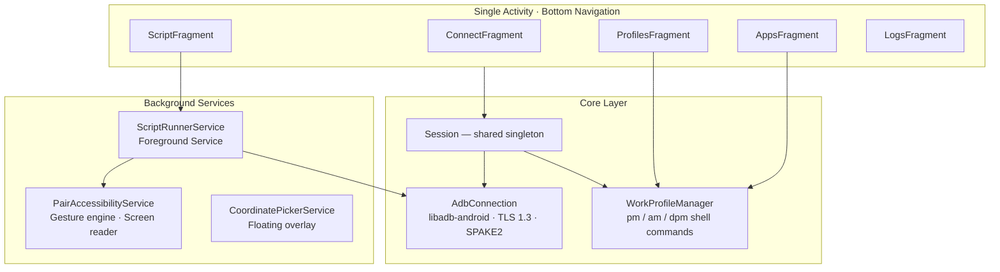
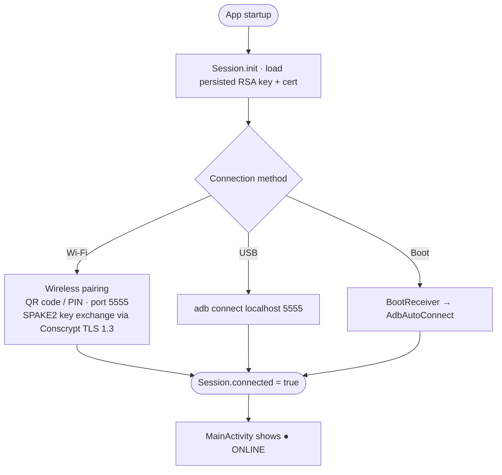
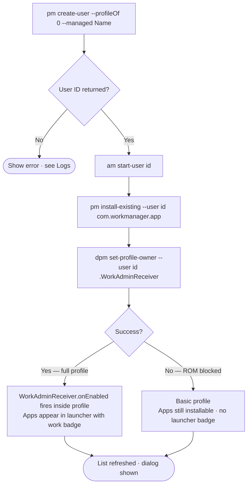
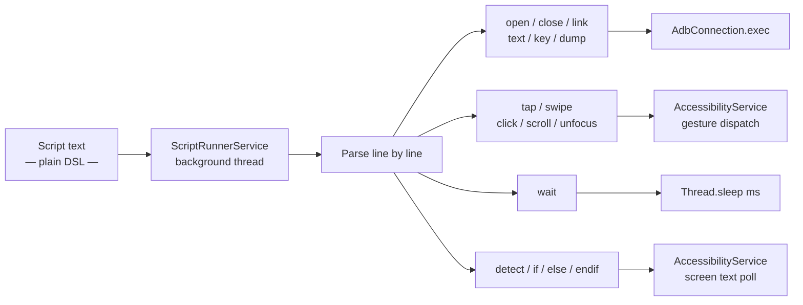

<div align="center">

# WorkManager

**Automate Android work profiles over ADB — no PC required**

[](https://developer.android.com)
[](https://developer.android.com/about/versions/oreo)
[](https://kotlinlang.org)
[](https://developer.android.com/tools/adb)
[](#license)

Create and manage isolated Android work profiles, install apps into them, and automate UI workflows — all from the device itself using a plain-text scripting DSL.

</div>

---

## Table of Contents

- [Overview](#overview)
- [Architecture](#architecture)
- [How It Works](#how-it-works)
  - [ADB Connection](#adb-connection)
  - [Work Profile Creation](#work-profile-creation)
  - [Script Execution](#script-execution)
  - [App Installation](#app-installation)
- [Script DSL Reference](#script-dsl-reference)
- [Features](#features)
- [Prerequisites](#prerequisites)
- [Setup](#setup)
- [Project Structure](#project-structure)
- [Roadmap](#roadmap)
- [Libraries](#libraries)
- [References](#references)

---

## Overview

WorkManager is a self-contained Android application that automates **Android managed work profiles** using an ADB connection to its own device over Wi-Fi or USB. It provides:

- A script editor with a simple line-by-line DSL
- A full work profile lifecycle manager (create, configure, remove)
- An app browser and installer (APK, split bundles, install-existing)
- An accessibility-based gesture engine that bypasses OEM restrictions
- A floating coordinate picker overlay for building tap scripts
- An in-app log viewer for observability

No root access and no PC are required after the initial ADB authorization.

> [!NOTE]
> WorkManager is designed for MIUI / HyperOS devices but works on any Android 8.0+ device with Wireless Debugging available in Developer Options.

---

## Architecture



### Component responsibilities

| Component | Role |
|---|---|
| `AdbConnection` | ADB wire protocol over TCP/USB. Generates a persistent RSA key + X.509 certificate. Wraps libadb-android for TLS 1.3 and SPAKE2 wireless pairing. |
| `WorkProfileManager` | All `pm`, `am`, and `dpm` ADB shell commands. Parses `pm list users` output, drives the profile creation/removal lifecycle, and handles APK installation sessions. |
| `ScriptRunnerService` | Foreground service that parses and executes the script DSL on a background thread. Running as a foreground service prevents MIUI/HyperOS from killing the process while the target app is in the foreground. |
| `PairAccessibilityService` | Dispatches gesture-based taps and swipes (bypasses OEM blocks on `adb shell input tap`). Traverses the accessibility tree to detect on-screen text for `detect` and `if` commands. |
| `CoordinatePickerService` | Floating overlay showing real-time touch coordinates, for building `tap` and `swipe` scripts. |
| `Session` | Singleton that owns the single `AdbConnection` instance and the selected work profile ID, shared across all fragments. |
| `AppLogger` | In-memory ring-buffer logger that feeds the in-app log viewer and optionally logcat. |

---

## How It Works

### ADB Connection



Wireless pairing uses Android 11's `ACTION_WIRELESS_DEBUG_PAIRING` flow. Once authorized, the device stores the app's public key in its `adb_keys` file so subsequent connections are automatic. `BootReceiver` re-establishes the connection after every device restart.

---

### Work Profile Creation



The created profile is a standard Android **managed profile** (`--profileOf 0 --managed`). Setting the app as **Profile Owner** via `dpm set-profile-owner` enables the work badge in the launcher and full device policy control. Some OEM ROMs (MIUI, HyperOS) restrict this command — in that case the profile still works but without the badge.

---

### Script Execution



Scripts are stored in `SharedPreferences` by `ScriptStore`. Multiple named scripts coexist; the active one loads into the editor on launch. The floating **■ Stop** button (overlay, always on top) cancels a running script at the next command boundary.

---

### App Installation

WorkManager supports three installation paths over the existing ADB connection:

| Method | Mechanism | Use case |
|---|---|---|
| **Install Existing** | `pm install-existing --user <id> <pkg>` | App already installed on device for another user |
| **Install APK** | Push to `/data/local/tmp/` → `pm install -r -d --user <id>` | Sideload a plain `.apk` from local storage |
| **Install Bundle** | Split install session: `pm install-create` → `install-write` × N → `install-commit` | Sideload `.xapk`, `.apks`, `.apkm` (split APK bundles) |

For bundles, the zip stream is processed in a single pass — each split APK is pushed to a temp path and written to the session immediately, so the file never needs to be fully buffered in RAM.

---

## Script DSL Reference

```
# comment line
// also a comment

── App control ──────────────────────────────────────────
open   com.example.app          Launch app in selected work profile
close  com.example.app          Force-stop app in selected work profile
link   https://url com.app      Open URL in a specific app

── Touch input ──────────────────────────────────────────
tap    540 1200                 Tap at absolute screen coordinates (X Y)
swipe  100 800 100 200 300      Swipe X1 Y1 → X2 Y2 in [duration ms]
click  Sign in                  Tap first element whose label matches
scroll down                     Scroll down once
scroll up 3                     Scroll up three times

── Text input ───────────────────────────────────────────
text   hello world              Type text into the focused field
unfocus                         Dismiss keyboard / clear focus

── Timing & detection ───────────────────────────────────
wait   2000                     Sleep for 2000 ms
detect Welcome                  Wait up to 15 s for text to appear on screen

── Control flow ─────────────────────────────────────────
if Sign in                      Execute block only if text is visible on screen
  tap 540 1200
else                            Flip the condition
  tap 540 900
endif

── System ───────────────────────────────────────────────
key    back                     Press hardware Back
key    home                     Press Home
key    enter                    Press Enter / Return
dump                            Log all on-screen UI elements with coordinates
```

> [!TIP]
> Use **Cmds** in the Script tab to insert any command via a searchable picker with app icons. Use the **coordinate overlay** (Coords button) to find exact X,Y values for `tap` and `swipe`.

---

## Features

- **Wi-Fi & USB ADB** — wireless pairing with QR/PIN, auto-reconnect on boot, USB fallback
- **Work profile lifecycle** — create, provision as profile owner, select, remove managed profiles
- **Script automation** — plain-text DSL with 16 commands including conditionals and text detection
- **Gesture engine** — accessibility-based taps bypass OEM restrictions on `adb shell input tap`
- **Coordinate overlay** — floating real-time X,Y display for building tap scripts without guessing
- **App installer** — APK, split APK bundles (XAPK / APKS / APKM), and install-existing
- **App browser** — all installed apps with real icon, display name, and package name; searchable
- **Configurable install defaults** — choose which packages get installed when setting up a new profile
- **In-app log viewer** — live scrolling log with keyword search and native text selection (no copy dialog)
- **Hacker terminal UI** — dark theme, neon green `#00e676` + electric blue `#00b4ff`, monospace

---

## Prerequisites

| Requirement | Details |
|---|---|
| Android 8.0+ (API 26) | Work profiles available from API 21; wireless pairing API requires API 30 |
| **Wireless Debugging** enabled | Settings → Developer Options → Wireless Debugging |
| **Accessibility** permission | Required for gesture-based taps and screen text reading |
| **Display over other apps** | Required for the coordinate picker overlay and script stop button |
| No root | All operations use unprivileged ADB shell commands |

---

## Setup

**1. Enable Developer Options**
Go to *Settings → About Phone* and tap **Build Number** 7 times.

**2. Enable Wireless Debugging**
Go to *Settings → Developer Options → Wireless Debugging* and turn it on.

**3. Install WorkManager**
Build from source or install the release APK.

**4. Connect**
Open the app → **Connect** tab.
- *Wireless:* tap **Wireless Pair**, follow the pairing prompt.
- *USB:* connect a cable, tap **USB Connect**.
- Status indicator changes to `● ONLINE` when connected.

**5. Create a work profile**
Go to **Profiles** tab → tap **+ Create** → enter a name → tap **Create**.
The profile is provisioned and appears in the list automatically.

**6. Install apps**
Go to **Apps** tab → **Install Default Apps** (Google Play Services, Play Store, Chrome) or **Load Apps** to browse and install from your device's app list.

**7. Write and run a script**
Go to **Script** tab → tap **Cmds** to insert commands, or type the DSL directly → tap **▶ Run**.

---

## Project Structure

<details>
<summary>Click to expand</summary>

```
app/src/main/
├── java/com/workmanager/app/
│   ├── AdbConnection.kt              ADB wire protocol, TLS 1.3, SPAKE2 pairing, RSA key management
│   ├── AdbAutoConnect.kt             Auto-reconnect over Wi-Fi and USB
│   ├── AdbAutoEnableService.kt       Background service for connection maintenance
│   ├── AdbConnectReceiver.kt         Broadcast receiver for connection events
│   ├── AdbHolder.kt                  Static ADB reference for cross-component access
│   ├── AdbNotificationManager.kt     Foreground service notification channel
│   ├── AppLogger.kt                  In-memory ring-buffer logger
│   ├── AppsFragment.kt               App browser, install-existing, APK/bundle installer
│   ├── AutomationService.kt          Secondary automation entry point
│   ├── BootReceiver.kt               Re-establishes ADB connection after device reboot
│   ├── ConnectFragment.kt            Wi-Fi pair, USB connect, auto-pair UI
│   ├── CoordinatePickerService.kt    Floating real-time coordinate display overlay
│   ├── FloatingButtonService.kt      Script stop floating button (always on top)
│   ├── InstallConfig.kt              SharedPreferences-backed install package selection
│   ├── LogsFragment.kt               Live log viewer with search + native text selection
│   ├── MainActivity.kt               Single-activity host, connection status dot
│   ├── PairAccessibilityService.kt   Gesture dispatch + accessibility tree reader
│   ├── ProfileBootstrapActivity.kt   Runs inside new profile to enable it via DPM
│   ├── ProfileStore.kt               Persists known profile IDs across app restarts
│   ├── ProfilesFragment.kt           Profile create / select / remove UI
│   ├── ScriptFragment.kt             Script editor, command picker with app icons
│   ├── ScriptRunnerService.kt        Foreground service that executes the script DSL
│   ├── ScriptStore.kt                Named script persistence in SharedPreferences
│   ├── Session.kt                    Singleton: AdbConnection + selected profile ID
│   ├── WorkAdminReceiver.kt          Device Policy admin component inside the work profile
│   └── WorkProfileManager.kt         All ADB shell ops: profile lifecycle, installs, launch
│
└── res/
    ├── drawable/
    │   ├── bg_input.xml              Dark bordered input field background
    │   ├── bg_section.xml            Card section background
    │   ├── bg_log_area.xml           Terminal-style log area background
    │   ├── ic_launcher_foreground.xml  Vector icon: terminal chevron + code lines
    │   └── ic_launcher_background.xml  Solid dark background for adaptive icon
    ├── layout/
    │   ├── activity_main.xml         Root layout with bottom navigation
    │   ├── fragment_connect.xml      Three pairing sections (Wireless, Auto, USB)
    │   ├── fragment_script.xml       Editor + Run/Stop + tool row
    │   ├── fragment_profiles.xml     Profile list + action row
    │   ├── fragment_apps.xml         Install section + searchable app list
    │   ├── fragment_logs.xml         Log viewer with search bar
    │   ├── dialog_help.xml           Script command reference
    │   ├── dialog_install_config.xml Search + checkbox list for default app picker
    │   ├── item_app.xml              App list row: icon + name + package
    │   ├── item_check_app.xml        Checkable app row for install config
    │   └── item_list.xml             Dark-themed plain list item
    └── values/
        └── themes.xml                Hacker dark theme + dialog theme overlay
```

</details>

---

## Roadmap

<details>
<summary>Near-term improvements</summary>

- **Script syntax highlighting** — color-code commands, packages, and comments in the editor using `SpannableString` on text change
- **Step debugger** — highlight the currently executing line; pause before each command for single-step debugging
- **Profile-aware app browser** — `pm list packages --user <id>` to show apps specific to each profile, not just the host device
- **Script variables** — `set key value` and `$key` substitution so scripts are reusable across different accounts or environments
- **Loop support** — `repeat N` / `end` blocks for retry logic without duplicating lines

</details>

<details>
<summary>Medium-term improvements</summary>

- **Multi-profile scripting** — a `profile <id>` command that switches the target work profile mid-script
- **Screenshot steps** — `screencap` at any step, saved with a timestamp for audit trails
- **Script scheduler** — cron-like schedule via `androidx.work.WorkManager` to run scripts automatically
- **Script import / export** — share `.wm` script files via Android share sheet

</details>

<details>
<summary>Longer-term improvements</summary>

- **Visual script builder** — drag-and-drop command blocks that generate the text DSL, lowering the barrier for non-technical users
- **OCR-based detection** — replace accessibility-tree text detection with on-device ML Kit OCR for apps that block the accessibility tree
- **Fleet mode** — connect to multiple devices simultaneously and run the same script on all of them in parallel
- **Cloud script sync** — store and version-control scripts in a shared backend; pull updates over the air

</details>

---

## Libraries

| Library | Version | Purpose |
|---|---|---|
| [libadb-android](https://github.com/MuntashirAkon/libadb-android) | 1.0.1 | ADB wire protocol, TLS 1.3 transport, Android 11+ SPAKE2 wireless pairing |
| [Conscrypt](https://github.com/google/conscrypt) | 2.5.2 | TLS 1.3 provider required by libadb's pairing handshake |
| [Bouncy Castle `bcprov`](https://www.bouncycastle.org/java.html) | 1.70 | RSA key generation for the persistent ADB identity |
| [Bouncy Castle `bcpkix`](https://www.bouncycastle.org/java.html) | 1.70 | Self-signed X.509 certificate builder (`JcaX509v3CertificateBuilder`) |
| [AndroidX Core KTX](https://developer.android.com/kotlin/ktx) | 1.12.0 | Kotlin extensions for Android APIs |
| [AndroidX AppCompat](https://developer.android.com/jetpack/androidx/releases/appcompat) | 1.6.1 | Backwards-compatible Activity, AlertDialog, and theme support |
| [Material Components](https://github.com/material-components/material-components-android) | 1.11.0 | `MaterialAlertDialogBuilder`, bottom navigation, theming system |
| [Lifecycle Runtime KTX](https://developer.android.com/jetpack/androidx/releases/lifecycle) | 2.7.0 | `lifecycleScope` for structured coroutine cancellation |
| [Kotlin Coroutines](https://github.com/Kotlin/kotlinx.coroutines) | 1.7.3 | `Dispatchers.IO` for all ADB shell calls off the main thread |

---

## References

| Resource | Relevance |
|---|---|
| [ADB Protocol specification](https://android.googlesource.com/platform/packages/modules/adb/+/refs/heads/master/protocol.txt) | Wire protocol implemented by libadb-android |
| [Android Managed Profiles](https://developer.android.com/work/managed-profiles) | `pm create-user --profileOf 0 --managed` and the profile lifecycle |
| [DevicePolicyManager](https://developer.android.com/reference/android/app/admin/DevicePolicyManager) | `dpm set-profile-owner` and `WorkAdminReceiver` |
| [AccessibilityService](https://developer.android.com/reference/android/accessibilityservice/AccessibilityService) | Gesture dispatch and accessibility node traversal |
| [PackageInstaller.Session](https://developer.android.com/reference/android/content/pm/PackageInstaller.Session) | Split APK install session replicated over ADB shell |
| [Android Wireless Debugging (API 30)](https://developer.android.com/tools/adb#wireless-android11-command-line) | The pairing flow and port structure used by the Connect screen |
| [SPAKE2 key agreement — RFC 9382](https://www.rfc-editor.org/rfc/rfc9382) | Password-authenticated key exchange in Android 11+ wireless pairing |
| [adb-auto-enable](https://github.com/mouldybread/adb-auto-enable) | Inspiration for the self-ADB-connect approach using libadb-android |

---

## License

Personal and educational use. All third-party libraries retain their original licenses — see each library's repository for details.

<div align="center">

---

Built with Kotlin · ADB · AndroidX · Material Design 3

</div>
